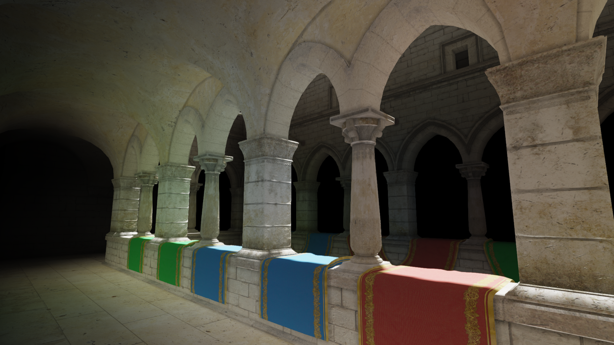
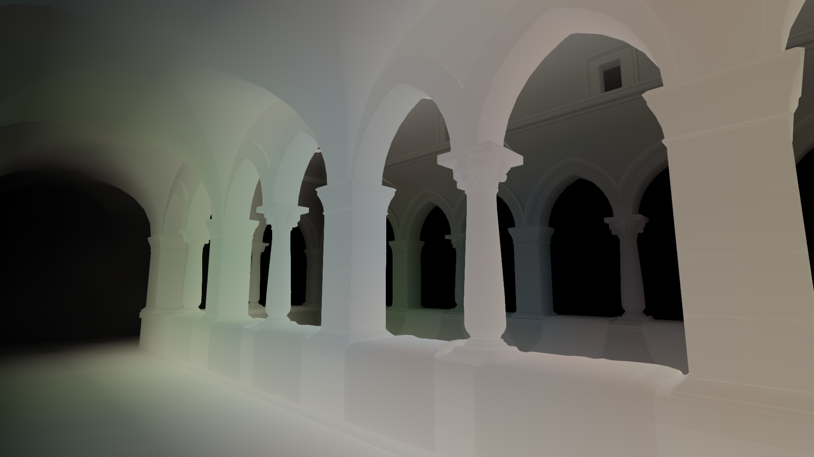

# Light-Propagation-Volumes
Masters dissertation.





## Features

- Light Propagation Volumes (LPV)
- Cascaded Shadow Maps (CSM)
- Horizon-based Ambient Occlusion (HBAO)
- Screen-Space Reflections (SSR)
- Fast Approximate Anti-Aliasing (FXAA)
- ACES Tone-mapping
- Bloom

## Build and Run with XMake

### Prerequisites

#### Windows

- [XMake](https://github.com/xmake-io/xmake)
- Visual Studio 2022 (or above) with C++ Desktop Development Environment
- Git 2.1 (or above)

#### Linux

#### Ubuntu / Other Debian Systems

To install XMake, simply use curl:

```bash
curl -fsSL https://xmake.io/shget.text | bash
```

Install other packages:

```bash
sudo apt-get install build-essential gcc-13 g++-13 cmake git libx11-dev libxrandr-dev libxrender-dev libglvnd-dev libxinerama-dev libxcursor-dev libxi-dev
```

### Build and Run

Clone this repo and go to the root directory first:

```bash
git clone git@github.com:zzxzzk115/Light-Propagation-Volumes.git
cd Light-Propagation-Volumes
xmake -vD -y
xmake run
```

## Acknowledgements

- [vgfw](https://github.com/zzxzzk115/vgfw) (Rendering Framework)
- [Light Propagation Volumes blog post](https://ericpolman.com/2016/06/28/light-propagation-volumes/)
- [FrameGraph-Example](https://github.com/skaarj1989/FrameGraph-Example) (The Best Practice of FrameGraph OpenGL Implementation)

> VGFW is also based on other 3rd-party libraries. See its README.

## License

This project is licensed under the [MIT](https://github.com/zzxzzk115/Light-Propagation-Volumes/blob/master/LICENSE) license.
